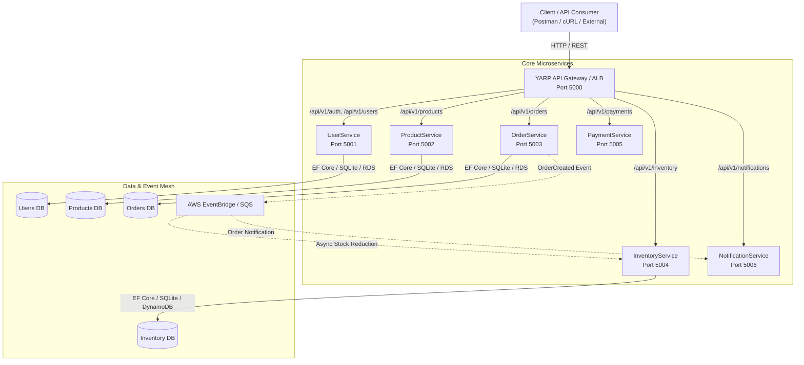

# SmartRetailX — Cloud-Native Distributed Microservices Platform

[]()
[]()
[]()
[]()
[]()

SmartRetailX is an enterprise-grade, cloud-native microservices e-commerce backend platform built with **.NET 10**, **Entity Framework Core**, **YARP API Gateway**, **Docker**, and **Kubernetes (EKS / ECS)**. It features role-based JWT authentication, asynchronous event messaging via AWS EventBridge/SQS, and automated test suites.

---

## 🏛️ System Architecture



---

## 🚀 Quick Start (Local Development)

### Prerequisites
- [.NET 10 SDK](https://dotnet.microsoft.com/download)
- [Docker & Docker Compose](https://www.docker.com/) (Optional)
- PowerShell 7+ or Bash

### 1. Run All Microservices via Docker Compose
To build and start the entire microservices mesh + API Gateway in containers:
```bash
docker-compose up --build
```
The services will be accessible at:
- **API Gateway:** `http://localhost:5000`

### 2. Run Individual Microservices (.NET CLI)
```bash
# Terminal 1: User Service (Auth & Profile)
cd source-code/UserService && dotnet run --urls "http://localhost:5001"

# Terminal 2: Product Service (Catalog)
cd source-code/ProductService && dotnet run --urls "http://localhost:5002"

# Terminal 3: Order Service (Checkout & Orders)
cd source-code/OrderService && dotnet run --urls "http://localhost:5003"

# Terminal 4: Inventory Service (Stock Management)
cd source-code/InventoryService && dotnet run --urls "http://localhost:5004"

# Terminal 5: API Gateway (Reverse Proxy)
cd api-gateway && dotnet run --urls "http://localhost:5000"
```

---

## 📡 REST API Reference

All endpoints are versioned under `/api/v1/` and provide Swagger documentation at `/swagger`.

| Service | Method | Route | Auth | Description |
| :--- | :---: | :--- | :---: | :--- |
| **Auth** | `POST` | `/api/v1/auth/login` | ❌ None | Authenticate user and receive signed JWT |
| **Auth** | `POST` | `/api/v1/auth/register` | ❌ None | Register user account |
| **Auth** | `GET` | `/api/v1/auth/me` | 🔒 Bearer | Get authenticated user profile |
| **Users** | `GET` | `/api/v1/users` | ❌ None | List all registered users |
| **Users** | `GET` | `/api/v1/users/{id}` | ❌ None | Get user profile by ID |
| **Users** | `POST` | `/api/v1/users` | ❌ None | Create user |
| **Users** | `PUT` | `/api/v1/users/{id}` | ❌ None | Update user |
| **Users** | `DELETE`| `/api/v1/users/{id}` | ❌ None | Delete user |
| **Products** | `GET` | `/api/v1/products` | ❌ None | List all products (supports `?category=` & `?search=`) |
| **Products** | `GET` | `/api/v1/products/{id}` | ❌ None | Get product details |
| **Products** | `POST` | `/api/v1/products` | ❌ None | Create catalog item |
| **Products** | `PUT` | `/api/v1/products/{id}` | ❌ None | Update catalog item |
| **Products** | `DELETE`| `/api/v1/products/{id}` | ❌ None | Remove catalog item |
| **Orders** | `POST` | `/api/v1/orders` | ❌ None | Place order & publish `OrderCreated` event |
| **Orders** | `GET` | `/api/v1/orders/{id}` | ❌ None | Get order details |
| **Orders** | `GET` | `/api/v1/orders/user/{userId}` | ❌ None | Get all orders by user ID |
| **Orders** | `PUT` | `/api/v1/orders/{id}/status` | ❌ None | Update status (`Pending`, `Processing`, `Shipped`, `Delivered`, `Cancelled`) |
| **Orders** | `DELETE`| `/api/v1/orders/{id}` | ❌ None | Cancel/Delete order |
| **Inventory**| `GET` | `/api/v1/inventory/{productId}` | ❌ None | Get live stock level |
| **Inventory**| `PUT` | `/api/v1/inventory/{productId}` | ❌ None | Update stock level directly |
| **Inventory**| `GET` | `/api/v1/inventory/check/{productId}` | ❌ None | Check stock availability |
| **Inventory**| `POST`| `/api/v1/inventory/reduce` | ❌ None | Reduce stock upon purchase |

---

## 🔒 Security & RBAC Implementation

- **JWT Tokens:** Generated using HMAC-SHA256 with claims (`sub`, `email`, `role`, `jti`, `exp`).
- **Role-Based Access Control (RBAC):** Supports `Customer` and `Admin` roles.
- **Default Seed Accounts:**
  - **Admin:** `admin@smartretailx.com` / `Admin@123`
  - **Customer:** `jane@example.com` / `secret123`
  - **Customer:** `alice@example.com` / `alice123`

---

## ☸️ Kubernetes Deployment (EKS / Local)

Deploy all manifests in order:
```bash
kubectl apply -f kubernetes/namespace.yaml
kubectl apply -f kubernetes/configmap.yaml
kubectl apply -f kubernetes/
```

To verify pods and services:
```bash
kubectl get pods -n smartretailx
kubectl get services -n smartretailx
```

---

## 🧪 Automated Testing

To run the automated regression test suite:
```powershell
pwsh tests/api/Run-ApiTests.ps1
```

For master end-to-end testing with automated process management:
```powershell
pwsh tests/api/Test-AllServices.ps1
```

For JMeter load testing:
```bash
jmeter -n -t tests/jmeter/SmartRetailX_Load_Test.jmx -l tests/jmeter/results/load_test_results.jtl -e -o tests/jmeter/results/dashboard
```

---

## 📂 Repository Structure

```
SmartRetailX/
├── api-gateway/               # YARP Reverse Proxy (.NET 10)
├── source-code/
│   ├── UserService/           # Auth, Users, JWT, EF Core
│   ├── ProductService/        # Catalog, Search, Categories, EF Core
│   ├── OrderService/          # Orders, EventBridge Publisher, EF Core
│   ├── InventoryService/      # Live Stock Control, EF Core
│   ├── PaymentService/        # Payment Processing
│   └── NotificationService/   # Asynchronous Notifications
├── kubernetes/                # Production K8s Manifests (Deployments, Ingress, Secrets)
├── infrastructure/            # CloudFormation AWS Templates
├── tests/
│   ├── api/                   # PowerShell & Postman Test Suites
│   └── jmeter/                # JMeter Load & Stress Test Plans
├── docker-compose.yml         # Local container orchestration
└── README.md                  # System Documentation
```
